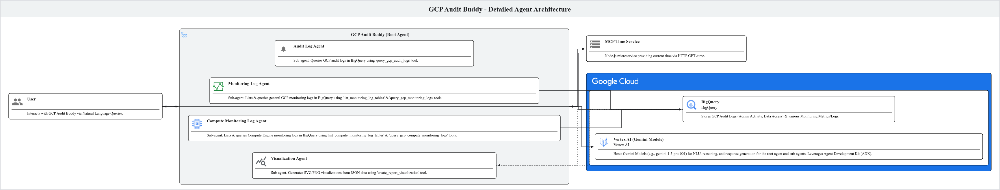
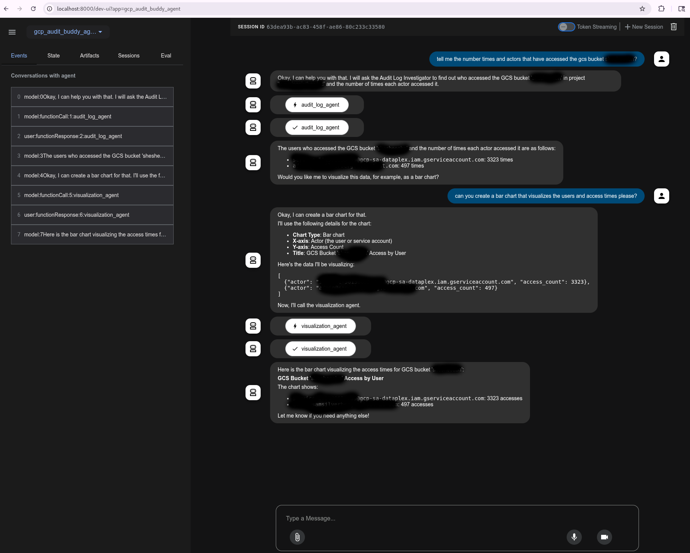

# System Architecture

This document provides an overview of the system architecture, including the agents, GCP services, and other components involved.

## Overview

This system is designed to assist with auditing Google Cloud Platform (GCP) resources. It leverages a conversational agent (`gcp_audit_buddy`) built with the Agent Development Kit (ADK) and powered by Gemini. The agent can query GCP audit logs and monitoring data stored in BigQuery, interact with a time service (`mcp_time_service`), and generate visualizations.

## System Diagram



## Components

### 1. gcp_audit_buddy
    - Description: A Python-based conversational agent responsible for orchestrating queries and analysis of GCP audit and monitoring data. It acts as a root agent that delegates tasks to specialized sub-agents. It interacts with GCP services (primarily BigQuery through its sub-agents) and can utilize the `mcp_time_service` for time-related information.
    - Sub-Agents:
        - **Audit Log Agent (`audit_log_agent`)**: Constructs and executes BigQuery SQL queries to retrieve GCP audit logs based on user requests. Uses the `query_gcp_audit_logs` tool.
        - **Monitoring Log Agent (`monitoring_log_agent`)**: Specialized for GCP monitoring logs. It can list available monitoring log tables in BigQuery and execute SQL queries against them using the `list_monitoring_log_tables` and `query_gcp_monitoring_logs` tools.
        - **Compute Monitoring Log Agent (`compute_monitoring_log_agent`)**: Specialized for GCP Compute Engine monitoring logs. It can list available compute monitoring log tables in BigQuery and execute SQL queries against them using the `list_compute_monitoring_log_tables` and `query_gcp_compute_monitoring_logs` tools.
        - **Visualization Agent (`visualization_agent`)**: Generates visualizations (SVG or PNG images) from JSON data. It uses the `create_report_visualization` tool to create charts like bar, line, pie, etc.
    - Technologies: Python, Poetry, Google ADK (`google-adk`), `google-cloud-aiplatform` (for Gemini model interaction), `google-genai`, `google-cloud-bigquery`, `pandas`, `matplotlib`, `seaborn`.
    - Flow: Receives user queries, determines the appropriate sub-agent or tool to use (including `mcp_time_service`). Sub-agents interact with BigQuery to fetch data. The `visualization_agent` can then be used to generate charts from the retrieved data. The root agent processes the information from sub-agents and tools to generate responses or visualizations for the user.

### 2. mcp_time_service
    - Description: A simple Node.js microservice that provides the current time, with an option to specify a UTC offset. It is used by `gcp_audit_buddy` likely for time-sensitive queries or operations.
    - Technologies: Node.js, Express.js.
    - Flow: Exposes an HTTP GET endpoint (`/time`) that returns the current time in ISO format. `gcp_audit_buddy` can call this endpoint.

### 3. Google Cloud Platform (GCP)
    - Services Used:
        - BigQuery (BQ): Primary data store for GCP audit logs (e.g., Admin Activity, Data Access) and monitoring metrics. `gcp_audit_buddy` queries BQ to retrieve data for analysis.
        - Vertex AI (Gemini Models): The `gcp_audit_buddy` agent and its sub-agents utilize Gemini large language models for natural language understanding, reasoning, and response generation.
        - Other GCP Services: [Potentially Cloud Functions/Run for deploying agents/services, Pub/Sub for event-driven architectures, though not explicitly detailed yet.]

### 4. Gemini
    - Role: Gemini Pro models (e.g., `gemini-1.5-pro-001`) are used as the core intelligence for the `gcp_audit_buddy` agent and its sub-agents. They handle instruction following, tool usage, and natural language interactions.

### 5. Agent Development Kit (ADK)
    - Role: The Google ADK is used to build, structure, and manage the `gcp_audit_buddy` agent and its sub-agents. It provides the framework for defining agent capabilities, tools, and prompts.

## Data Flow

1.  User interacts with `gcp_audit_buddy` via a natural language query.
2.  `gcp_audit_buddy` (powered by Gemini and ADK) interprets the query.
3.  If necessary, `gcp_audit_buddy` calls `mcp_time_service` for current time information.
4.  `gcp_audit_buddy` and/or its specialized sub-agents construct and execute queries against BigQuery to fetch relevant audit logs or monitoring data.
5.  Data retrieved from BigQuery is processed and analyzed by the agents.
6.  Results are formulated into a natural language response, or a visualization is generated.
7.  The response/visualization is presented to the user.

## ADK Web UI



## Deployment

This section outlines the typical production deployment strategy for the `gcp_audit_buddy` system on Google Kubernetes Engine (GKE) using the Agent Development Kit (ADK) best practices.

### 1. Prerequisites
- A Google Cloud Project with billing enabled.
- `gcloud` command-line tool installed and configured.
- Kubernetes `kubectl` command-line tool installed.
- Necessary GCP APIs enabled (Kubernetes Engine API, Artifact Registry API, Cloud Build API, Vertex AI API, BigQuery API).

### 2. Containerization & Artifact Registry
- **Artifact Registry**: An Artifact Registry repository (e.g., `adk-repo`) is created in the GCP project to store Docker container images.
  ```bash
  gcloud artifacts repositories create adk-repo \
      --repository-format=docker \
      --location=$GOOGLE_CLOUD_LOCATION \
      --description="ADK Agent Repository"
  ```
- **Agent Containerization**: The `gcp_audit_buddy` Python application is containerized. This typically involves a Dockerfile that sets up the Python environment, copies the agent code, and installs dependencies defined in `poetry.lock` (via `pyproject.toml`).
- **Building and Pushing Image**: The container image for `gcp_audit_buddy` is built using Cloud Build and pushed to the created Artifact Registry.
  ```bash
  gcloud builds submit \
      --tag $GOOGLE_CLOUD_LOCATION-docker.pkg.dev/$GOOGLE_CLOUD_PROJECT/adk-repo/gcp-audit-buddy:latest \
      --project=$GOOGLE_CLOUD_PROJECT \
      . # Assuming Dockerfile is in the root of gcp_audit_buddy
  ```
- **`mcp_time_service` Containerization**: The `mcp_time_service` Node.js application is similarly containerized and its image pushed to Artifact Registry.

### 3. GKE Cluster Setup
- **Create GKE Cluster**: A GKE Standard cluster is used. If creating a new Standard cluster, ensure Workload Identity is enabled. If using an existing cluster, verify Workload Identity is active.
  ```bash
  # Example for creating a GKE Standard cluster (adjust parameters as needed):
  gcloud container clusters create adk-cluster \
      --zone=$GOOGLE_CLOUD_LOCATION \ # Or --region for regional clusters
      --project=$GOOGLE_CLOUD_PROJECT \
      --workload-pool=$GOOGLE_CLOUD_PROJECT.svc.id.goog # Enable Workload Identity
      # Add other parameters like machine type, node count, etc., as required.
  ```
- **Connect to Cluster**: Configure `kubectl` to communicate with the GKE cluster.
  ```bash
  gcloud container clusters get-credentials adk-cluster \
      --location=$GOOGLE_CLOUD_LOCATION \
      --project=$GOOGLE_CLOUD_PROJECT
  ```

### 4. Kubernetes Manifests for `gcp_audit_buddy`
- **Service Account**: It's recommended to create a dedicated Kubernetes Service Account and a corresponding GCP Service Account. Workload Identity is used to allow the Kubernetes SA to impersonate the GCP SA, granting the agent secure access to GCP resources (BigQuery, Vertex AI) without needing to manage service account keys.
- **Deployment (`deployment.yaml`)**: Defines how `gcp_audit_buddy` is deployed.
  ```yaml
  apiVersion: apps/v1
  kind: Deployment
  metadata:
    name: gcp-audit-buddy
  spec:
    replicas: 1 # Or more for high availability
    selector:
      matchLabels:
        app: gcp-audit-buddy
    template:
      metadata:
        labels:
          app: gcp-audit-buddy
      spec:
        serviceAccountName: gcp-audit-buddy-sa # Kubernetes SA configured for Workload Identity
        containers:
        - name: gcp-audit-buddy-agent
          image: $GOOGLE_CLOUD_LOCATION-docker.pkg.dev/$GOOGLE_CLOUD_PROJECT/adk-repo/gcp-audit-buddy:latest
          resources:
            limits:
              memory: "512Mi" # Adjust based on agent needs
              cpu: "1000m"    # Adjust based on agent needs
            requests:
              memory: "256Mi"
              cpu: "500m"
          ports:
          - containerPort: 8080 # ADK default port
          env:
            - name: PORT
              value: "8080"
            - name: GOOGLE_CLOUD_PROJECT
              value: "YOUR_GCP_PROJECT_ID" # Should be parameterized or use Downward API
            - name: GOOGLE_CLOUD_LOCATION
              value: "YOUR_GCP_LOCATION"   # Should be parameterized
            - name: GOOGLE_GENAI_USE_VERTEXAI
              value: "true"
            # Add other environment variables required by gcp_audit_buddy
  ```
- **Service (`service.yaml`)**: Exposes the `gcp_audit_buddy` deployment, typically via a LoadBalancer for external access or ClusterIP for internal access.
  ```yaml
  apiVersion: v1
  kind: Service
  metadata:
    name: gcp-audit-buddy-svc
  spec:
    type: LoadBalancer # Or ClusterIP if only internal access is needed
    ports:
      - port: 80
        targetPort: 8080
    selector:
      app: gcp-audit-buddy
  ```

### 5. Deployment of `mcp_time_service`
- The `mcp_time_service` would have its own `deployment.yaml` and `service.yaml` similar to `gcp_audit_buddy`, adjusted for its Node.js specifics (e.g., image name, container port 3001 as seen in its `server.js`). It would likely be exposed via a ClusterIP service if only called by `gcp_audit_buddy` within the cluster.

### 6. Applying Manifests
- The Kubernetes manifests are applied to the GKE cluster:
  ```bash
  kubectl apply -f deployment.yaml
  kubectl apply -f service.yaml
  # Repeat for mcp_time_service manifests
  ```

This setup provides a scalable and manageable production environment for the agent system on GCP.
