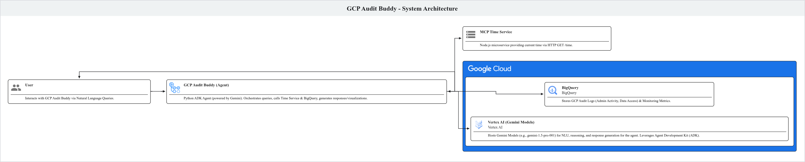

# System Architecture

This document provides an overview of the system architecture, including the agents, GCP services, and other components involved.

## Overview

This system is designed to assist with auditing Google Cloud Platform (GCP) resources. It leverages a conversational agent (`gcp_audit_buddy`) built with the Agent Development Kit (ADK) and powered by Gemini. The agent can query GCP audit logs and monitoring data stored in BigQuery, interact with a time service (`mcp_time_service`), and generate visualizations.

## System Diagram

## Components

### 1. gcp_audit_buddy
    - Description: A Python-based conversational agent responsible for orchestrating queries and analysis of GCP audit and monitoring data. It uses sub-agents specialized in different tasks like BQ audit log investigation, BQ monitoring log analysis, Compute monitoring log analysis, and report visualization. It interacts with GCP services (primarily BigQuery) and can utilize the `mcp_time_service`.
    - Technologies: Python, Poetry, Google ADK (`google-adk`), `google-cloud-aiplatform` (for Gemini model interaction), `google-genai`, `google-cloud-bigquery`, `pandas`, `matplotlib`, `seaborn`.
    - Flow: Receives user queries, determines the appropriate sub-agent or tool to use (including `mcp_time_service`), interacts with BigQuery to fetch data, processes the data (potentially using sub-agents), and generates responses or visualizations.

### 2. mcp_time_service
    - Description: A simple Node.js microservice that provides the current time, with an option to specify a UTC offset. It is used by `gcp_audit_buddy` likely for time-sensitive queries or operations.
    - Technologies: Node.js, Express.js.
    - Flow: Exposes an HTTP GET endpoint (`/time`) that returns the current time in ISO format. `gcp_audit_buddy` can call this endpoint.

### 3. Google Cloud Platform (GCP)
    - Services Used:
        - BigQuery (BQ): Primary data store for GCP audit logs (e.g., Admin Activity, Data Access) and monitoring metrics. `gcp_audit_buddy` queries BQ to retrieve data for analysis.
        - Vertex AI (Gemini Models): The `gcp_audit_buddy` agent and its sub-agents utilize Gemini large language models for natural language understanding, reasoning, and response generation.
        - Other GCP Services: [Potentially Cloud Functions/Run for deploying agents/services, Pub/Sub for event-driven architectures, though not explicitly detailed yet.]

### 4. Gemini
    - Role: Gemini Pro models (e.g., `gemini-1.5-pro-001`) are used as the core intelligence for the `gcp_audit_buddy` agent and its sub-agents. They handle instruction following, tool usage, and natural language interactions.

### 5. Agent Development Kit (ADK)
    - Role: The Google ADK is used to build, structure, and manage the `gcp_audit_buddy` agent and its sub-agents. It provides the framework for defining agent capabilities, tools, and prompts.

## Data Flow

1.  User interacts with `gcp_audit_buddy` via a natural language query.
2.  `gcp_audit_buddy` (powered by Gemini and ADK) interprets the query.
3.  If necessary, `gcp_audit_buddy` calls `mcp_time_service` for current time information.
4.  `gcp_audit_buddy` and/or its specialized sub-agents construct and execute queries against BigQuery to fetch relevant audit logs or monitoring data.
5.  Data retrieved from BigQuery is processed and analyzed by the agents.
6.  Results are formulated into a natural language response, or a visualization is generated.
7.  The response/visualization is presented to the user.

## Deployment

[Information about how the components are deployed.]
